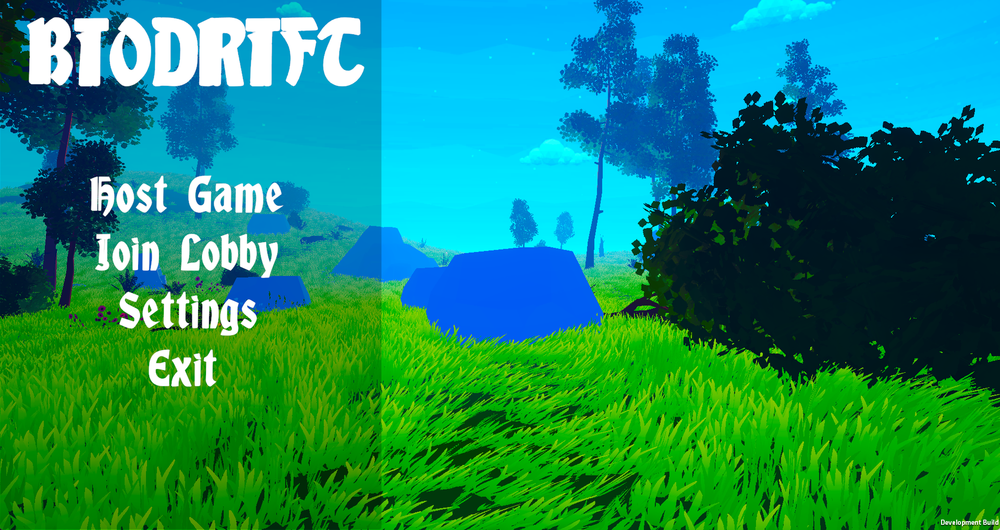

  

<h1 align="center">🌿 Biodrift-V1.0</h1>

  An action-packed adventure where nature and technology collide. Navigate through treacherous terrains and overcome challenges in this unique action game.

  
  
  

## 📸 Screenshots

  
  

---

## 🚀 Features

- 🌍 **Dynamic Environments**: Experience ever-changing landscapes that challenge your adaptability.
- 🛠 **Innovative Mechanics**: Utilize a blend of natural abilities and technological tools to progress.
- 🎶 **Immersive Soundtrack**: Engage with a captivating soundtrack that complements the game's atmosphere.

---

## ⌨️ Controls

| Action     | Key             |
|------------|-----------------|
| Move       | WASD / Arrows   |
| Interact   | E               |
| Jump       | Space           |
| Sprint     | Shift           |
| Pause/Menu | Esc             |

---

